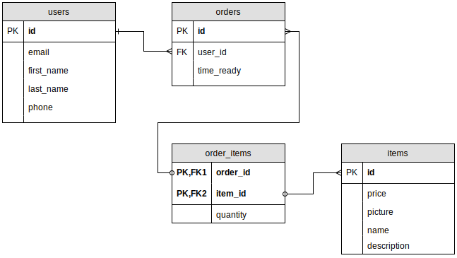
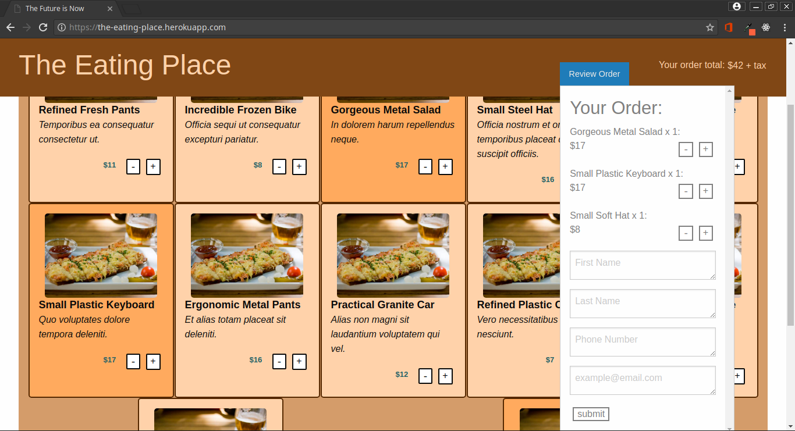

# The Eating Place

A single page application to order food from a restaurant.

Build using a jQuery/SASS/PostgreSQL/Nodejs/Express stack.

Upon placing an order, the backend will place a phone call to the restaurant to read out the order, and ask how many minutes till the order will be ready for pickup.  The restaurant can either press numbers on the phone, or state how many minutes.  The backend will then notify the customer via SMS when their order will be ready for pickup.

An example (with phone capabilities disabled) can be viewed at <a href="http://the-eating-place.herokuapp.com">http://the-eating-place.herokuapp.com</a>

## Setup

1. Fork repository and clone
2. `npm install`
3. `npm start`

### dotenv

The following environment variables are required:
- DB_HOST
- DB_USER
- DB_PASS
- DB_NAME
- DB_SSL
- DB_PORT
- PORT
- TWILIO_SID
- TWILIO_AUTH_TOKEN

## Dependencies

- body-parser
- dotenv
- ejs
- express
- foundation-sites
- knex
- knex-logger
- node-sass-middleware
- pg
- twilio

## Screenshots
### Database ERD

### Screenshot of Front End
